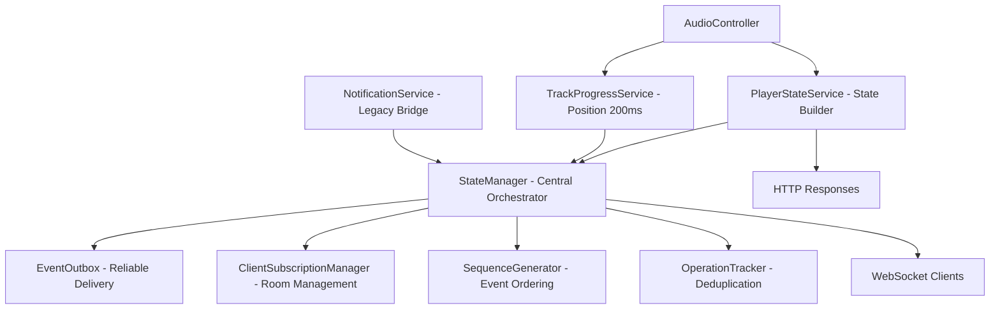
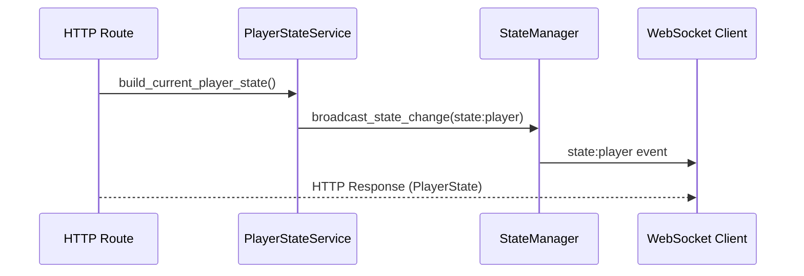
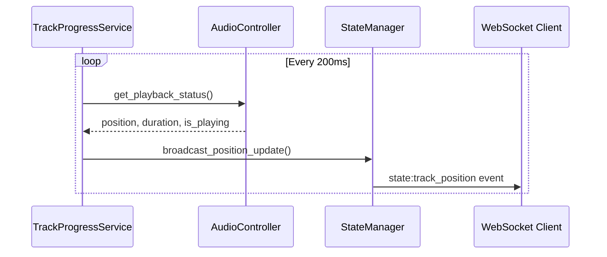
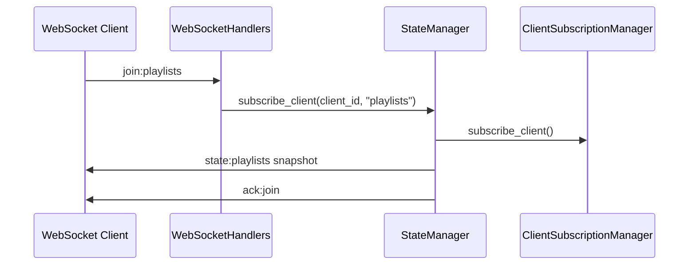
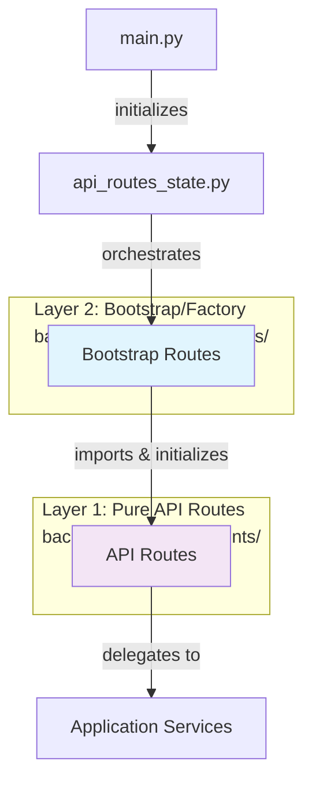

# Backend Services Architecture - TheOpenMusicBox

> **Warning**: This document may contain outdated service names and file paths. The codebase has evolved to use DDD architecture with services in `app/src/application/services/` and `app/src/domain/`. Please verify file paths before referencing.

## Overview

TheOpenMusicBox uses a **Domain-Driven Design (DDD)** architecture with a **server-authoritative** approach. The architecture clearly separates the Application, Domain, and Infrastructure layers, with 8 coordinated services to manage player state and real-time updates.

## General Architecture



## Detailed Services

### 1. StateManager - Central Orchestrator (ACTIVE)

**File**: `app/src/services/state_manager.py`
**Class**: `StateManager`

**Responsibilities**:
- Central coordination of all real-time events
- WebSocket broadcasting to subscribed clients
- Room management ("playlists", "playlist:{id}")
- Unified interface for state broadcasting

**Key Methods**:
```python
async def broadcast_state_change(event_type, data, playlist_id=None)
async def broadcast_position_update(position_ms, track_id, is_playing)
async def subscribe_client(client_id, room)
```

**Internal Components**:
- **EventOutbox**: Reliable delivery with retry
- **ClientSubscriptionManager**: Client subscription management
- **SequenceGenerator**: Thread-safe sequential numbering
- **OperationTracker**: Duplicate prevention

### 2. PlayerStateService - State Builder (ACTIVE)

**File**: `app/src/services/player_state_service.py`

**Responsibilities**:
- Building consistent PlayerState objects
- Unified interface between AudioController and API responses
- Player data normalization

**Key Methods**:
```python
async def build_current_player_state() -> PlayerState
async def build_track_progress_state() -> dict
async def broadcast_playlist_started(playlist_id)  # Legacy
```

**Usage**: Used by all player routes to generate standardized HTTP responses.

### 3. TrackProgressService - Real-Time Position (ACTIVE)

**File**: `app/src/services/track_progress_service.py`

**Responsibilities**:
- Position emissions every 200ms during playback
- Lightweight updates for smooth tracking
- Throttling to prevent spam (150ms minimum)
- Automatic error recovery

**Configuration**:
```python
POSITION_UPDATE_INTERVAL_MS = 200  # socket_config
POSITION_THROTTLE_MIN_MS = 150
```

**Data Flow**:
```
AudioController.get_playback_status() -> position_ms, duration_ms, is_playing
-> StateManager.broadcast_position_update()
-> WebSocket state:track_position event
```

### 4. NotificationService - Transitional Service (PARTIALLY ACTIVE)

**File**: `app/src/services/notification_service.py`

**Components**:

#### PlaybackSubject (Deprecated)
- **Status**: Removed in DDD architecture
- **Replacement**: StateManager handles all emissions
- **Migration**: Completely migrated to StateManager

#### DownloadNotifier (Active)
- **Usage**: YouTube download events
- **Emissions**: `youtube:progress`, `youtube:complete`, `youtube:error`

### 5-8. StateManager Internal Components (ALL ACTIVE)

#### ClientSubscriptionManager
```python
# WebSocket room subscription management
async def subscribe_client(client_id: str, room: str)
async def unsubscribe_client(client_id: str, room: str)
def get_subscribed_clients(room: str) -> Set[str]
```

#### EventOutbox
```python
# Reliable delivery with retry
async def add_event(event_id, payload, target_room)
async def process_outbox()  # Retry failed emissions
```

#### SequenceGenerator
```python
# Thread-safe sequence numbers
async def get_next_global_seq() -> int
async def get_next_playlist_seq(playlist_id: str) -> int
```

#### OperationTracker
```python
# Duplicate operation prevention
def is_processed(client_op_id: str) -> bool
def mark_processed(client_op_id: str, result: any)
```

## Communication Flows

### Player State Events


### Continuous Position Updates


### Client Subscription


## WebSocket Event Types

| Event | Emitter | Frequency | Payload | Purpose |
|-------|---------|-----------|---------|---------|
| `state:player` | StateManager | On demand | Full PlayerState | Complete player state |
| `state:track_position` | TrackProgressService | 200ms | Lightweight position | Smooth position tracking |
| `state:playlists` | StateManager | On demand | Playlist collection | List synchronization |
| `youtube:progress` | DownloadNotifier | Continuous | Download progress | YouTube feedback |

## Service Initialization

### Startup Order (DDD Architecture)
1. **main.py** -> `Application.initialize_async()`
2. **DomainBootstrap** -> Domain initialization
3. **Application Services** -> DDD application services
4. **StateManager** creation with internal components
5. **TrackProgressService** background startup scheduling
6. **WebSocket handlers** registration
7. **Infrastructure** -> Concrete services (DB, Hardware)
8. Services ready for requests

### Configuration
```python
# app/src/config/socket_config.py - Actual configuration
class SocketConfig:
    POSITION_UPDATE_INTERVAL_MS = 200
    POSITION_THROTTLE_MIN_MS = 150
    OUTBOX_RETRY_MAX = 3
    OUTBOX_SIZE_LIMIT = 1000
    OPERATION_DEDUP_WINDOW_SEC = 300
    CLIENT_TIMEOUT_SEC = 60
```

## Architectural Patterns

### Server-Authoritative
- **Single source of truth**: Backend maintains authoritative state
- **Subscribed clients**: Frontend subscribes to updates
- **Sequencing**: All events have a sequence number
- **Conflict resolution**: Server state always takes priority

### Event Sourcing
- **Standardized envelope**: All events follow the same format
- **Global sequence**: Guaranteed chronological order
- **Traceability**: Unique event_id for debugging
- **Replay**: Ability to reconstruct state

### Reliability Patterns
- **Outbox Pattern**: Event queue with retry
- **Circuit Breaker**: Automatic error recovery
- **Throttling**: Network overload prevention
- **Deduplication**: Prevents multiple processing

## Metrics and Monitoring

### Available Statistics
```python
# get_stats() method available for monitoring
# Exact structure depends on StateManager implementation
```

### Logging
- **StateManager**: Non-position events only (avoids spam)
- **TrackProgressService**: Errors and recovery
- **Components**: Periodic statistics

## Frontend-Backend Consistency

### WebSocket Events
- **Backend StateManager** -> **Frontend socketService** -> **serverStateStore**
- Standardized format with envelope and sequence
- Appropriate rooms for efficiency

### HTTP Responses
- **Backend PlayerStateService** -> **Frontend apiService** -> **UI Components**
- Identical PlayerState structure
- Consistent error handling

This architecture guarantees **reliable real-time communication** with **consistent state** between all clients and **optimal performance** via intelligent throttling.

## Routing Architecture (Two-Layer Pattern)

TheOpenMusicBox implements a **two-layer routing architecture** following DDD and Dependency Injection principles.

### Overview



### Layer 1: Pure API Routes (`back/app/src/api/endpoints/`)

**Responsibilities**:
- FastAPI endpoint definitions
- HTTP request/response handling
- Input validation (Pydantic)
- Business logic delegation
- **DOES NOT HANDLE**: Service instantiation, lifecycle management

**Files** (7 total, ~2,829 LOC):
- `player_api_routes.py` - Player control endpoints
- `nfc_api_routes.py` - NFC association endpoints
- `playlist_api_routes.py` - Playlist management endpoints
- `system_api_routes.py` - System and health endpoints
- `upload_api_routes.py` - Upload session endpoints
- `web_api_routes.py` - Web/static endpoints
- `youtube_api_routes.py` - YouTube endpoints

### Layer 2: Bootstrap Routes (`back/app/src/routes/factories/`)

**Responsibilities**:
- Dependency creation and wiring
- Service initialization
- Dependency injection configuration
- Route registration with FastAPI
- Lifecycle management

**Files** (7 total, ~761 LOC):
- `player_routes_ddd.py` - Player routes bootstrap
- `nfc_unified_routes.py` - NFC routes bootstrap
- `playlist_routes_ddd.py` - Playlist routes bootstrap
- `system_routes.py` - System routes bootstrap
- `upload_routes.py` - Upload routes bootstrap
- `web_routes.py` - Web routes bootstrap
- `youtube_routes.py` - YouTube routes bootstrap

### Dependency Flow

```python
# Layer 2: Bootstrap (routes/factories/player_routes_ddd.py)
class PlayerRoutesDDD:
    def __init__(self, app, socketio, coordinator):
        # Initialize services
        self.state_manager = UnifiedStateManager(socketio)
        self.player_service = PlayerApplicationService(coordinator, self.state_manager)
        self.broadcasting_service = PlayerBroadcastingService(self.state_manager)

        # Initialize API routes with dependencies
        self.api_routes = PlayerAPIRoutes(
            player_service=self.player_service,
            broadcasting_service=self.broadcasting_service
        )

        # Register with FastAPI
        app.include_router(self.api_routes.get_router())

# Layer 1: API Routes (api/endpoints/player_api_routes.py)
class PlayerAPIRoutes:
    def __init__(self, player_service, broadcasting_service):
        self.router = APIRouter(prefix="/api/player")
        self._player_service = player_service  # Received via DI
        self._broadcasting_service = broadcasting_service

    def _register_routes(self):
        @self.router.post("/play")
        async def play():
            # Delegates to service - no instantiation
            result = await self._player_service.play_use_case()
            await self._broadcasting_service.broadcast_state_change(...)
            return UnifiedResponseService.success(...)
```

### Benefits of This Architecture

1. **Separation of Concerns**
   - API routes: HTTP logic only
   - Bootstrap: dependency management only

2. **Testability**
   - API routes testable with mocks
   - Bootstrap testable for wiring verification

3. **Flexibility**
   - Easy to replace implementations
   - Isolated dependency modifications

4. **Clean Architecture**
   - Respects dependency direction
   - Follows DDD principles

### Patterns Used

- **Factory Pattern**: Bootstrap routes create and configure handlers
- **Dependency Injection**: Dependencies injected via constructor
- **Single Responsibility**: Each layer has a unique responsibility

### Important Note

This structure **IS NOT duplication** but an intentional architectural pattern. The two route folders serve distinct complementary purposes.

**Full documentation**: See [routing-architecture.md](./routing-architecture.md) for complete details.
