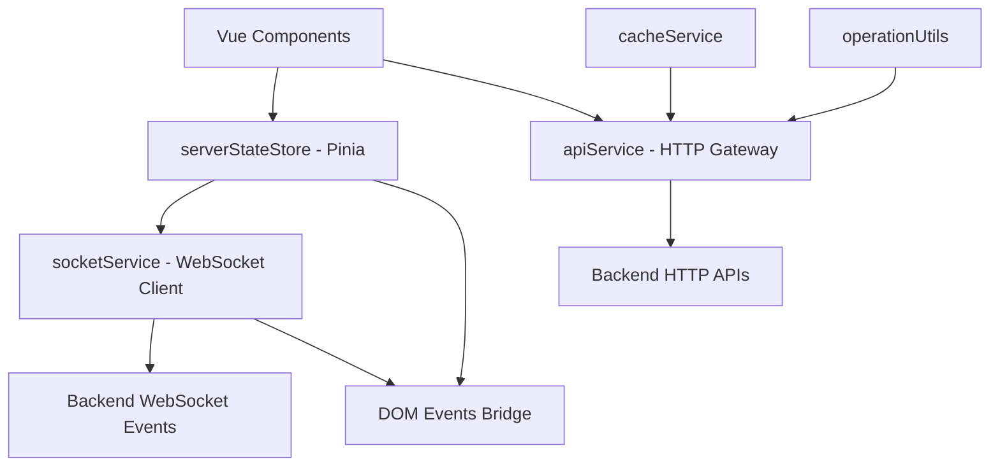
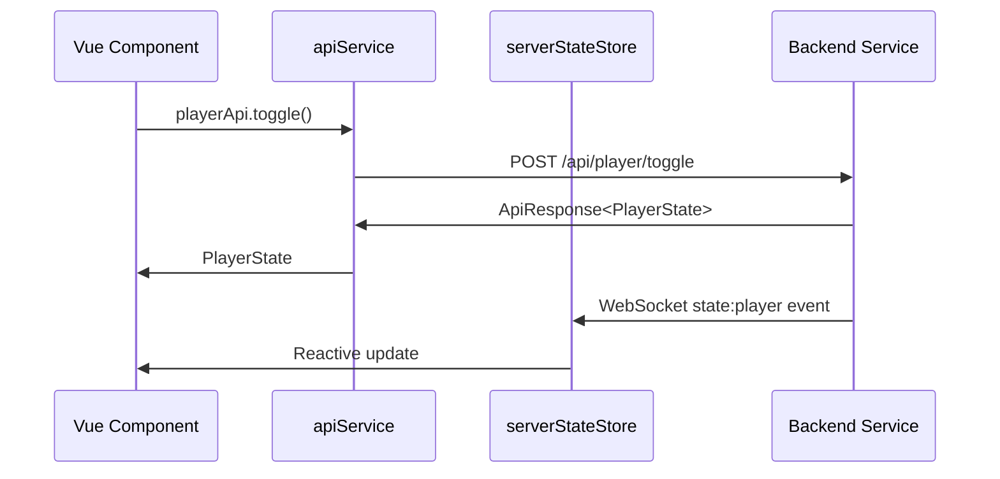
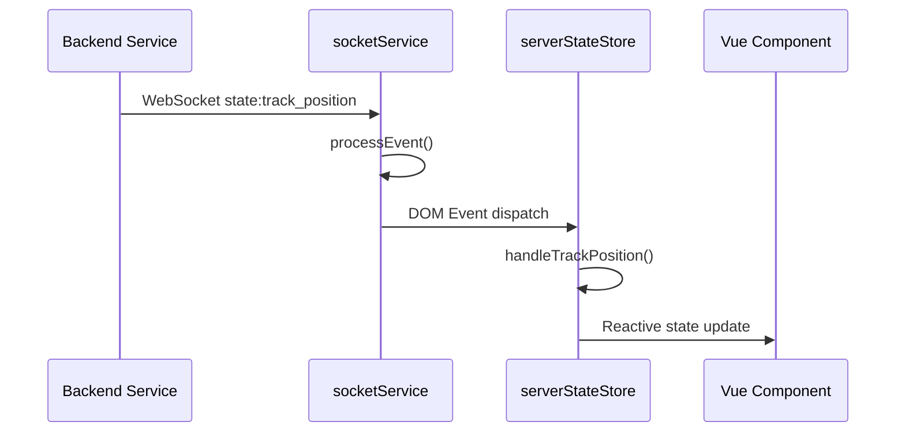
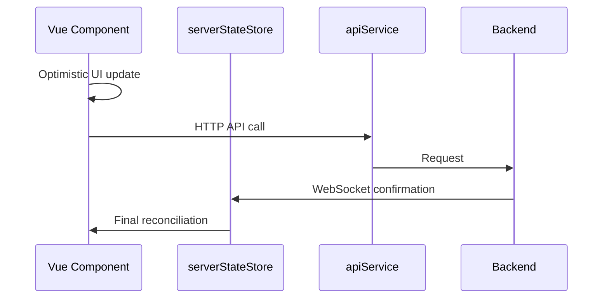

# Frontend Architecture - TheOpenMusicBox

## Overview

The TheOpenMusicBox frontend architecture follows a **server-authoritative** pattern with real-time synchronization via WebSocket, complete HTTP API integration, and reactive Vue.js components. The backend serves as the single source of truth, with the frontend acting as a reactive presentation layer.

## Service Architecture

### Main Service Layer



## Core Services

### 1. serverStateStore.ts - Centralized State Management

**Architecture**: Pinia Store with server-authoritative state
**File**: `front/src/stores/serverStateStore.ts`

**Responsibilities**:
- Single source of truth for server state
- Real-time synchronization via WebSocket
- Client operation deduplication
- Optimistic updates with server reconciliation

**Data Structure**:
```typescript
interface PlayerState {
  // Playback state
  is_playing: boolean;
  state: PlaybackState;

  // Current playlist/track
  active_playlist_id: string | null;
  active_playlist_title: string | null;
  active_track_id: string | null;
  active_track: Track | null;

  // Playback position
  position_ms: number;
  duration_ms: number;

  // Playlist navigation
  track_index: number;
  track_count: number;
  can_prev: boolean;
  can_next: boolean;

  // Audio control
  volume: number;
  muted: boolean;

  // System
  server_seq: number;
}
```

**Event Handlers**:
- `state:player` -> Full player state
- `state:track_position` -> Lightweight 200ms position
- `state:playlists` -> Playlist collection
- `ack:op` / `err:op` -> Operation confirmations

### 2. apiService.ts - HTTP API Gateway

**Architecture**: Modular HTTP gateway by domain
**File**: `front/src/services/apiService.ts`

**Specialized Services**:
- **playerApi**: Player control (toggle, seek, volume)
- **playlistApi**: Playlist CRUD + pagination management
- **uploadApi**: Chunked upload with progress
- **systemApi**: System health and volume
- **nfcApi**: NFC tag management and associations
- **youtubeApi**: YouTube search and download

**Features**:
```typescript
// Standardized error handling
class StandardApiError extends Error {
  constructor(message: string, type: string, status: number) {
    this.type = type;
    this.status = status;
  }
}

// Response extractor with validation
class ApiResponseHandler {
  static extractData<T>(response: AxiosResponse<ApiResponse<T>>): T {
    return response.data.data!;
  }
}
```

### 3. socketService.ts - WebSocket Communication

**Architecture**: Event-driven WebSocket client
**File**: `front/src/services/socketService.ts`

**Responsibilities**:
- Bidirectional real-time communication
- Room subscriptions (playlists, playlist:id, nfc)
- Event sequencing and buffering
- Automatic reconnection with re-subscription

**Configuration**:
```typescript
// Actual configuration in environment.ts
const socketConfig = {
  autoConnect: true,
  transports: ['websocket', 'polling']
}
```

**Event Pattern**:
```typescript
// Server event reception
private processEvent(envelope: StateEventEnvelope): void {
  this.emitLocal(envelope.event_type, envelope)

  // CRITICAL: DOM bridge for serverStateStore
  window.dispatchEvent(new CustomEvent(envelope.event_type, {
    detail: envelope
  }))
}
```

## Backend Dependencies by Service

### HTTP API Dependencies

#### playerApi -> Backend Player Routes
```typescript
// Consumed endpoints (actual routes)
GET /api/player/status           // PlayerStateService
POST /api/player/toggle          // PlayerStateService + StateManager
POST /api/player/seek            // PlayerStateService + StateManager
POST /api/player/volume          // PlayerStateService + StateManager
POST /api/player/stop            // PlayerStateService + StateManager
POST /api/player/next            // PlayerStateService + StateManager
POST /api/player/previous        // PlayerStateService + StateManager

// Standardized responses
ApiResponse<PlayerState> {
  status: "success",
  message: "...",
  data: PlayerState,
  server_seq: number
}
```

#### playlistApi -> Backend Playlist Routes
```typescript
// CRUD Operations
GET /api/playlists/              // PlaylistController.get_all_playlists()
GET /api/playlists/{id}          // PlaylistRepository.get_playlist_with_tracks()
POST /api/playlists/             // PlaylistCoreService.create_playlist()
PUT /api/playlists/{id}          // PlaylistCoreService.update_playlist()
DELETE /api/playlists/{id}       // PlaylistCoreService.delete_playlist()

// Playback Control
POST /api/playlists/{id}/start   // PlaylistOrchestrator.start_playlist()

// Responses with cache
cacheService.set(cacheKey, result, 10000); // TTL 10s
```

#### uploadApi -> Backend Upload System
```typescript
// Chunked upload
POST /api/playlists/{id}/uploads/session     // Upload session init
PUT /api/playlists/{id}/uploads/{session}/chunks/{index}  // Chunk upload
POST /api/playlists/{id}/uploads/{session}/finalize      // Upload finalize

// Progress tracking
interface UploadStatus {
  session_id: string;
  status: 'pending' | 'uploading' | 'completed' | 'error';
  progress_percent: number;
  current_chunk: number;
  total_chunks: number;
}
```

### WebSocket Event Dependencies

#### Server -> Client Events
```typescript
// Main states
'state:player'            // StateManager -> playerState updates
'state:track_position'    // TrackProgressService -> position 200ms
'state:playlists'         // StateManager -> collection updates

// Specific events
'state:playlist_created'  // PlaylistCoreService -> new playlist
'state:track_added'       // TrackService -> new track
'youtube:progress'        // DownloadNotifier -> YouTube progress

// Acknowledgments
'ack:op'                  // Success confirmation for operation
'err:op'                  // Operation error with client_op_id
```

#### Client -> Server Events
```typescript
// Room subscriptions
'join:playlists'    -> ClientSubscriptionManager.subscribe_client()
'join:playlist'     -> Room playlist:${id}
'join:nfc'          -> NFC events room

// Synchronization
'sync:request'      -> StateManager.send_state_snapshot()
```

## Vue.js Component Architecture

### Main Components and Backend Dependencies

#### AudioPlayer.vue - Main Player
```vue
<template>
  <TrackInfo :track="currentTrack" :playlistTitle="playerState?.active_playlist_title"/>
  <ProgressBar :currentTime="currentTime" :duration="duration" @seek="seekTo"/>
  <PlaybackControls :isPlaying="isPlaying" @toggle-play-pause="togglePlayPause"/>
</template>
```

**Backend Dependencies**:
- **State**: `serverStateStore.playerState` (via `state:player` events)
- **Position**: `state:track_position` events every 200ms
- **Actions**: `apiService.playPlayer()`, `apiService.seekPlayer()`

**Real-time Flow**:
```typescript
// Real-time position update
const unwatchPosition = serverStateStore.$subscribe((mutation, state) => {
  if (state.playerState.position_ms !== lastServerPosition) {
    currentTime.value = state.playerState.position_ms / 1000 // ms -> s
  }
})
```

#### FilesList.vue - File Management
**Backend Dependencies**:
- **Loading**: `apiService.getPlaylist(playlistId)` lazy loading
- **Drag & Drop**: `apiService.reorderTracks()`, `apiService.moveTrackBetweenPlaylists()`
- **NFC**: `apiService.startNfcAssociation()`, `nfc_association_state` events

**Lazy loading pattern**:
```typescript
async loadPlaylistTracks(playlistId: string) {
  if (!this.loadedPlaylists.has(playlistId)) {
    const playlist = await apiService.getPlaylist(playlistId)
    this.loadedPlaylists.set(playlistId, playlist.tracks)
  }
}
```

#### SimpleUploader.vue - File Upload
**Backend Dependencies**:
- **Session**: `uploadApi.initUpload()`
- **Chunks**: `uploadApi.uploadChunk()` with FormData
- **Finalization**: `uploadApi.finalizeUpload()`
- **Progress**: Polling `uploadApi.getUploadStatus()`

**Chunked upload**:
```typescript
async uploadFile(file: File, playlistId: string) {
  const session = await uploadApi.initUpload(playlistId, file.name, file.size)
  const chunks = this.createChunks(file, session.chunk_size)

  for (const [index, chunk] of chunks.entries()) {
    await uploadApi.uploadChunk(playlistId, session.session_id, index, chunk)
    this.updateProgress((index + 1) / chunks.length * 100)
  }

  return await uploadApi.finalizeUpload(playlistId, session.session_id)
}
```

## Data Flows

### HTTP Request/Response Cycle


### Real-Time Updates


### Optimistic Updates


## Architectural Patterns

### Server-Authoritative State
- **Single source**: Backend maintains authoritative state
- **Subscriptions**: Frontend subscribes to updates
- **Reconciliation**: Server state takes priority over client optimism
- **Sequencing**: server_seq guarantees event order

### Event-Driven Architecture
```typescript
// Publisher-subscriber pattern via DOM events
class SocketService {
  private processEvent(envelope: StateEventEnvelope): void {
    // Internal handlers
    this.emitLocal(envelope.event_type, envelope)

    // DOM bridge for decoupling
    window.dispatchEvent(new CustomEvent(envelope.event_type, {
      detail: envelope
    }))
  }
}

// Store listens for DOM events
export const useServerStateStore = defineStore('serverState', () => {
  // Setup DOM event listeners
  window.addEventListener('state:player', (e) => handlePlayerState(e.detail))
  window.addEventListener('state:track_position', (e) => handleTrackPosition(e.detail))
})
```

### Reactive State Management
```typescript
// Reactive state with computed properties
const currentTrack = computed(() => {
  return playerState.value?.active_track || props.selectedTrack || null
})

const duration = computed(() => {
  if (playerState.value?.duration_ms && playerState.value.duration_ms > 0) {
    return playerState.value.duration_ms / 1000
  }
  return currentTrack.value?.duration_ms ? currentTrack.value.duration_ms / 1000 : 0
})
```

## Configuration and Deployment

### Environment Variables
```typescript
// Actual configuration in environment.ts
export const apiConfig = {
  baseUrl: isDevelopment
    ? (process.env.VUE_APP_API_URL || 'http://localhost:5004')
    : window.location.origin,
  withCredentials: !isDevelopment,
  timeout: isDevelopment ? 60000 : 30000
}
```

### Build and Assets
- **Framework**: Vue 3 + TypeScript + Vite
- **State**: Pinia for state management
- **Styling**: Tailwind CSS with design tokens
- **PWA**: Service Worker for offline cache
- **Bundle**: Code splitting by routes and vendors

## Performance and Optimizations

### Lazy Loading
```typescript
// Deferred playlist loading
const getPlaylistById = computed(() => (id: string) => {
  return playlists.value.find(p => p.id === id) ||
         cachedPlaylists.get(id) ||
         null
})
```

### Caching Strategies
```typescript
// Smart cache with TTL
export class CacheService {
  set(key: string, data: any, ttl: number = 60000): void {
    this.cache.set(key, {
      data,
      expires: Date.now() + ttl,
      hits: 0
    })
  }
}
```

### Position Update Throttling
```typescript
// 200ms throttling for position updates
let lastServerPosition = 0
const unwatchPosition = serverStateStore.$subscribe((mutation, state) => {
  if (state.playerState.position_ms !== lastServerPosition) {
    // Avoids updates if a seek is in progress
    if (!isSeekInProgress.value) {
      currentTime.value = state.playerState.position_ms / 1000
    }
  }
})
```

## Security and Reliability

### Error Handling
```typescript
// Standardized errors with retry
export class ApiClient {
  private async handleError(error: AxiosError): Promise<StandardApiError> {
    if (error.response?.status >= 500) {
      // Automatic retry for server errors
      return this.retryWithBackoff(error.config)
    }
    return new StandardApiError(error.message, 'client_error', error.response?.status)
  }
}
```

### Client-Side Validation
```typescript
// Validation before sending to backend
async function seekTo(timeSeconds: number) {
  const maxDurationSeconds = 86400 // 24h
  if (timeSeconds < 0 || timeSeconds > maxDurationSeconds) {
    logger.error('Seek position out of bounds', { timeSeconds })
    return
  }

  const timeMs = Math.floor(Math.round(timeSeconds * 1000))
  await apiService.seekPlayer(timeMs)
}
```

## External Integrations

### WebSocket Reliability
```typescript
// Automatic reconnection with state
socketService.on('reconnect', () => {
  // Automatic re-subscription to rooms
  subscribeToPlaylists()
  requestStateSync()
  requestInitialPlayerState()
})
```

### Hardware Integration
- **NFC**: Interface via dedicated endpoints with real-time feedback
- **Audio**: Control via backend audio service abstraction

This frontend architecture demonstrates a **clear separation of concerns** with **robust real-time capabilities**, making the system suitable for a responsive music application with hardware integrations.
